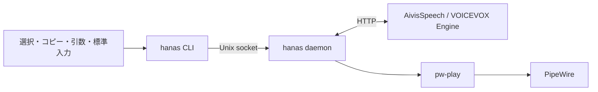

# hanas 実装指示書

作成日: 2026-09-19（Asia/Tokyo）

対象: このワークスペースで実装する別のエージェント

## 1. 目的と合意事項

ブラウザ、ターミナル、AI エージェントの出力から、ユーザーが指定したテキストをキャラクターの声で読み上げるデスクトップ用ツールを作る。

ユーザーが明示した要件:

- 主用途は選択部分の読み上げ。スクリーンリーダーとしての画面全体の認識は不要。
- 最初は声だけ。立ち絵や口パクは不要。
- TTS は AivisSpeech を優先し、難しい場合は VOICEVOX を使用する。
- この指示書を作成する作業では仕様策定と簡単な検証までを行い、製品の実装は別のエージェントに任せる。
- 実装言語の選定は任されている。

以下の API、コマンド名、上限値、開発順序は、上記を満たすための設計上の決定である。既存の実装や計測済みの性能を表すものではない。実装を複雑にする事情が判明したら、要件を保った小さな修正を行い、この文書も更新する。

## 2. 対象環境と検証状況

対象は Linux、NixOS、niri（Wayland）、PipeWire。今回確認した環境では `python3`、`wl-paste`、`pw-play`、`niri`、`systemctl`、`nix` が利用できる。

- PRIMARY selection と通常のクリップボードがテキスト形式を提供していることを確認した。本文は取得していない。
- 合成した 0.2 秒の無音 WAV を `pw-play` で再生できた。
- 本文中の niri キー設定例は `niri validate` を通過した。
- `127.0.0.1:10101/version` と `127.0.0.1:50021/version` は接続拒否。別ポートや別ホストでの稼働までは調べていない。
- この環境の PATH に `docker` と `podman` はなかった。コンテナ方式が直ちに使えるとは仮定しない。
- 実際の TTS 合成、音質、合成遅延、ブラウザ・ターミナル別の選択取得は未検証。

再現手順、実測値、調査元は [検証記録](docs/VALIDATION.md) を参照する。

## 3. 初版の範囲

初版で実装するもの:

1. 引数、標準入力、PRIMARY selection、通常のクリップボードからの読み上げ。
2. daemon による再生の一元管理、即時停止、新規要求による置き換え、明示的なキュー追加。
3. 話者スタイル一覧、スタイル選択、話速設定。
4. 長文の分割合成と、最大 1 チャンクの先読み。
5. 状態確認、エラー報告、完了を待てる CLI。
6. AivisSpeech を既定とする HTTP 接続。設定変更で VOICEVOX に接続できる共通部分。
7. Nix での実行環境・パッケージ定義と、systemd user service / niri の設定例。

初版の対象外:

- GUI、立ち絵、口パク、Live2D、トレイアイコン。
- OCR、アクセシビリティツリーの巡回、ブラウザ拡張、画面監視。
- クリップボードの常時監視、自動コピーのためのキー送信。
- AI エージェント固有のフック、トークン単位の入力ストリーミング、MCP サーバー。
- 要約、翻訳、LLM による整形、Markdown の本格的な構文処理、コードブロックの自動除外。
- 音声履歴、永続キュー、音声キャッシュ、モデルの自動ダウンロード、GPU 自動設定。
- pause/resume、音声合成エンジンの自動切り替え、エンジン自体の起動・停止管理。

標準入力は **EOF まで読み、1 件の読み上げ要求として送る**。`agent-command | hanas speak --stdin` は、そのコマンドがテキストを標準出力に出して終了する場合に利用できる。TUI の画面表示や無期限ストリームへの対応を意味しない。

## 4. 構成と実装言語

Python 3.11 以降を使用する。初版は標準ライブラリを中心に実装し、音声処理はエンジンと `pw-play` に任せる。HTTP サーバーフレームワークや音声再生ライブラリは導入しない。



- `argparse`、`tomllib`、`json`、`asyncio`、`urllib.request` などを使用する。
- 選択内容は **CLI 側で取得してから** daemon に送る。キュー処理時に取得し直さない。daemon は Wayland への接続を必要としない。
- daemon の制御受付と HTTP / 再生待ちは分離する。同期 HTTP は専用ワーカー、または `asyncio.to_thread` で実行し、制御イベントループを塞がない。
- 音声合成ワーカーは 1 つ、再生プロセスは同時に 1 つ。プラグイン基盤や汎用ジョブ管理基盤は作らない。
- `hanas daemon` はフォアグラウンドで動作する。常駐管理は systemd に任せ、二重 fork や自動 daemon 起動は実装しない。
- 製品用依存を追加する場合は、その必要性を説明する。Nix のパッケージ化に必要なビルド依存は別扱いとする。

## 5. CLI 契約

下記はこれから実装するコマンドであり、現時点では存在しない。

```sh
hanas daemon
hanas voices
hanas speak "処理が終わりました。"
hanas speak --selection
hanas speak --clipboard
hanas speak --stdin < text.txt
hanas speak --enqueue "続けて読む文章です。"
hanas speak --wait --speed 1.2 --style-id 123 "動作確認です。"
hanas stop
hanas status
hanas status --json
```

`123` は構文説明用の仮 ID。実際には `hanas voices` で得た ID を使う。

| コマンド・オプション | 意味 |
| --- | --- |
| `speak TEXT` | UTF-8 の文章を 1 つの位置引数で渡す |
| `speak --stdin` | 標準入力を EOF まで読む |
| `speak --selection` | PRIMARY selection からテキストを取得 |
| `speak --clipboard` | 通常のクリップボードからテキストを取得 |
| `speak --enqueue` | 現在の読み上げを保ち、要求全体を FIFO の末尾に追加 |
| `speak --style-id INT` | その要求の話者スタイルを上書き。符号付き 32 bit 整数 |
| `speak --speed FLOAT` | その要求の話速を上書き |
| `speak --wait` | 受理後も待ち、読み上げ完了・失敗・キャンセルを終了コードで返す |
| `stop` | 現在の再生を止め、受理済みの待ち行列をすべて取り消す |
| `voices` | 設定されたエンジンの話者名、スタイル名、スタイル ID を表示 |
| `status [--json]` | daemon の状態を表示 |

設定ファイルの指定は `hanas daemon --config PATH` と `hanas voices --config PATH` で受け付ける。ほかのコマンドには `--config` を設けず、稼働中 daemon の設定を使用する。設定パスの異なる daemon を並行稼働させる機能は作らない。`voices` は daemon がなくても設定されたエンジンへ直接問い合わせられる。独自の設定パスで daemon を起動した場合、`voices` にも同じパスを渡す。

入力と結果の規則:

- `TEXT` / `--stdin` / `--selection` / `--clipboard` は排他的。無指定では使用方法を表示して失敗する。
- `--selection` は `wl-paste --primary --no-newline --type text`、`--clipboard` は `wl-paste --no-newline --type text` 相当を引数配列で実行する。
- 選択取得失敗時に通常のクリップボードへ自動フォールバックしない。コピーして `--clipboard` を使うよう案内する。
- PRIMARY selection はアプリが最後に提供した内容であり、「現在フォーカス中のアプリの今の選択」であることまでは保証できない。
- 入力取得失敗、空白のみ、UTF-8 不正、上限超過、設定値不正では要求を受理せず、現在の再生を変更しない。
- 既定の `speak` は受理されたら job ID を標準出力に返して終了する。終了コード 0 は再生完了を意味しない。
- `--wait` の接続が切れても受理済みの読み上げは継続する。停止は `hanas stop` で明示する。
- `stop` は冪等。読み上げがなくても成功する。daemon 不在の場合は接続エラーとする。
- `status` はエンジン応答を待たず、再生中 job ID、待機件数、合成中か、再生中か、直近の結果・エラーを返す。本文は表示しない。

終了コードは `0=成功`、`2=入力・設定エラー`、`3=daemon/エンジンに接続不可`、`4=合成・再生などの処理失敗`、`5=--wait で待っていた job のキャンセル` とする。通常の `speak` が受理後に失敗した場合は、daemon のログと `status` に記録する。

## 6. 再生、キュー、キャンセル

### 基本動作

既定の `speak` は置き換えモード。入力と設定を検証して受理した時点で、それ以前の現在 job と待機 job を取り消す。合成失敗時に以前の読み上げを復活させない。

`--enqueue` は要求単位の FIFO。別の job の文章を交互に読まない。上限超過時は新しい要求を拒否し、受理済み job を変更しない。

状態更新は daemon 内で直列化する。`stop` より前に受理された要求は取り消し、その後に受理された新しい要求は実行可能とする。入力取得中や EOF 待ちの CLI はまだ要求を送っていないため、`stop` 後に送信すれば新しい要求として扱う。

### AivisSpeech の制約を踏まえた停止

AivisSpeech の調査対象コードでは `/cancellable_synthesis` が 501 を返し、通常の `/synthesis` は WAV 全体を生成してから返す。このため、**再生停止とエンジン内の計算中断を分けて扱う**。[公式ルーター実装](https://github.com/Aivis-Project/AivisSpeech-Engine/blob/master/voicevox_engine/app/routers/tts_pipeline.py)

1. `stop` / 置き換え時に世代番号を進め、対象 job と先読み結果を無効にする。
2. 所有する `pw-play` 子プロセスだけを終了させて回収する。SIGTERM 後 0.5 秒で終了しなければ、その子に SIGKILL を送り回収する。`pkill pw-play` は使わない。
3. 合成中の HTTP 応答を待たずに停止処理を完了できるようにする。
4. 合成結果を受け取った時と再生を開始する直前に job / 世代の有効性を確認する。無効な WAV は破棄する。
5. 合成ワーカーは進行中のリクエストの終了またはタイムアウトを待つ。ワーカーを次々に作り直してリクエストを重ねない。

Python のスレッドで動く同期 HTTP は、待機する asyncio Task を cancel しただけでは終了しない。この点を踏まえ、`stop` は job の無効化を行い、合成ワーカーの寿命と独立させる。

この設計では古い音声の再生を防げるが、**置き換えた新しい文章の合成開始は、古いリクエストの終了まで待つことがある**。HTTP タイムアウト後もエンジン側で計算が続く可能性があり、エンジン内部の同時実行数まで保証するものではない。

### 先読みとエラー

- 最初のチャンクができたら再生を開始する。全文の合成完了を待たない。
- 再生中に次の 1 チャンクだけを合成する。再生待ち WAV が 1 つできたら、その消費まで合成を待つ。
- 次の job の先読みは行わない。
- 合成または再生に失敗した job は、残りのチャンクとその再生を中止して失敗にする。後続の待機 job は順に処理する。
- キャンセル済み job の遅れて到着した失敗は、新しい job の失敗として扱わない。
- daemon 終了時には所有する再生プロセスを回収し、再起動後に旧キューを復元しない。

## 7. テキスト処理と上限

初版はテキストをできる限りそのまま読む。要約、単語削除、読み方の推測による書き換えは行わない。

処理順序:

1. UTF-8 とサイズを検証する。
2. ANSI CSI / OSC シーケンスを除去する。OSC 8 リンクでは表示テキストを残し、リンクの制御情報を除去する。
3. CRLF と CR を LF に統一する。タブは空白にし、改行以外の不要な C0 制御文字を除去する。端末画面の再描画は再現しない。
4. 前後の空白を除去し、空になったら拒否する。
5. 段落境界と日本語の `。！？` を分割候補にする。単一改行は空白として扱い、空行は段落境界として扱う。
6. 最大 120 Unicode コードポイントで分割する。境界がなければ上限で切る。句読点を捨てず、可能なら直後の閉じ括弧も前の文に含める。

分割で文字を欠落・重複させない。ASCII のピリオドを無条件に分割点にしない。英語・URL・コードの自然な読み方の改善は後続課題とする。

以下は初版の設計値。実測に基づく制限ではない。

| 項目 | 上限・既定値 |
| --- | --- |
| 1 入力の読み込み | 64 KiB。標準入力・クリップボードを上限 + 1 byte までで打ち切って判定 |
| 1 入力の文字数 | 整形前で 10,000 Unicode コードポイント |
| 1 合成チャンク | 120 Unicode コードポイント |
| 待機 job | 16 件。実行中の 1 件は別枠 |
| クリップボード取得期限 | 3 秒 |
| 1 IPC メッセージ | 1 MiB |
| 1 WAV レスポンス | 32 MiB |
| HTTP ソケット I/O タイムアウト | 30 秒 |
| 話速 | 既定 1.0、初版の入力許容範囲 0.5〜2.0 の有限数 |

話速範囲は製品側の制約で、各エンジンの全許容範囲を表さない。`urllib` の timeout は厳密なリクエスト全体の期限ではないため、そのような保証を表示しない。入力や HTTP レスポンスを無制限に読み込んでからサイズ検証しない。

## 8. TTS アダプター

既定 URL は `http://127.0.0.1:10101`。VOICEVOX 利用時は `http://127.0.0.1:50021` と、そのエンジンで取得したスタイル ID に設定し直す。エンジン障害を理由に自動で別の声へ切り替えない。

使用する API は次の共通部分に限定する。

| API | 用途 |
| --- | --- |
| `GET /version` | 接続確認・実機検証でのバージョン記録 |
| `GET /speakers` | 話者とスタイルの列挙、設定 ID の確認 |
| `POST /audio_query?text=...&speaker=...` | 音声合成用 JSON を取得 |
| `POST /synthesis?speaker=...` | JSON を送り WAV を取得 |

出典: [AivisSpeech API の利用方法](https://github.com/Aivis-Project/AivisSpeech-Engine#音声合成-api-を使う)、[VOICEVOX Engine](https://github.com/VOICEVOX/voicevox_engine)。

実装上の条件:

- URL のパラメーターは URL エンコードし、シェル文字列に埋め込まない。
- `speaker` に送る値は `/speakers` の `styles[].id`。UUID や配列インデックスではない。負数も扱えるようにする。
- CLI の上書きと設定のどちらにもスタイルがない場合、または指定 ID が一覧に存在しない場合、勝手に先頭の声を選ばず設定方法を案内する。
- `/audio_query` の JSON は未知フィールドも含めて保持する。変更するのは、今回提供する設定である `speedScale` のみ。
- AivisSpeech の `kana` は原文を保持する用途があり、`tempoDynamicsScale` などの追加フィールドもある。VOICEVOX 専用の型へ詰め直して削除しない。[互換性の説明](https://github.com/Aivis-Project/AivisSpeech-Engine#voicevox-api-との互換性について)
- クライアントは合成済み WAV のサンプルレートを固定しない。ファイルとして `pw-play` に渡す。
- エラーの HTTP ステータス、JSON 不正、不正な WAV、タイムアウトを区別する。無制限な自動リトライはしない。
- ループバックへの接続には環境変数の HTTP proxy を適用しない。
- `/streaming_synthesis` や `/cancellable_synthesis` は初版で使わない。対応状況を両エンジンで同一とみなさない。

## 9. 設定、IPC、ファイルの寿命

設定は `$XDG_CONFIG_HOME/hanas/config.toml`、未設定なら `~/.config/hanas/config.toml`。daemon 起動時に読み込み、変更の反映には再起動を必要とする。話者・速度の CLI 上書きはその job 限り。既定パスにファイルがない場合は既定 URL と話速を使用し、daemon 起動と `voices` は利用可能にする。明示的な `--config` のファイルがない場合は設定エラーにする。

```toml
[engine]
url = "http://127.0.0.1:10101"
# hanas voices の出力を確認して設定する。CLI の --style-id でも指定可能。
# style_id = 123
speed = 1.0
```

未知の設定キーや不正な値は、タイプミスを黙って無視せず設定エラーにする。HTTP URL は `http` / `https` のみを許可する。追加の設定項目を必要以上に増やさない。

IPC は `$XDG_RUNTIME_DIR/hanas/daemon.sock`。`XDG_RUNTIME_DIR` 不在は明示的なエラーとする。ディレクトリは 0700、ソケットと一時 WAV は 0600 を基本とする。

- UTF-8 の改行区切り JSON。本文の改行は JSON 文字列内でエスケープする。
- プロトコルのバージョンと操作種別を明示し、不正入力は接続単位で拒否する。
- 通常は 1 接続 1 要求と受理応答。`--wait` のみ同じ接続で job の終端結果も受け取る。
- 遅い、不正な、切断されたクライアントによって、ほかの `stop` / `status` が待たされないようにする。
- daemon の単一起動は OS のロックで保証する。ロック取得前に既存ソケットを削除しない。
- WAV は専用 runtime ディレクトリ内の一意な一時ファイルへ保存し、再生終了・失敗・キャンセル時に削除する。
- 起動時の残骸清掃は、単一起動ロックを得てから、その専用ディレクトリ内で自分が作ったと識別できるファイルだけを対象にする。
- 原文、クリップボード本文、`audio_query` の text を含む URL を通常ログへ出さない。job ID、段階、経過時間、エラー分類を記録する。
- 生の HTTP 例外文字列には URL や本文が含まれる場合があるため、そのままログや `status` に出さない。

再生には WAV の一時ファイルを使う。パイプ入力の対応フォーマットに依存させない。[PipeWire の再生ツール](https://docs.pipewire.org/page_man_pw-cat_1.html)

## 10. 起動とデスクトップ統合

アプリ用の Nix 開発環境・パッケージ定義を用意する。実行時の `wl-paste` / `pw-play` もパッケージのラッパーから参照できるようにする。Python 以外の言語への変更や大きなフレームワーク導入は不要。

systemd user service は以下を基本とする。

- `Type=simple`、`ExecStart=<インストールされた hanas の絶対パス> daemon`。
- `Restart=on-failure`、`RestartSec=2`、`UMask=0077`。
- `RuntimeDirectory=hanas`、`RuntimeDirectoryMode=0700`。
- niri のセッションに合わせて `PartOf=graphical-session.target` と `WantedBy=graphical-session.target` を設定する例を提供する。
- daemon と TTS エンジンは別サービス。エンジンが停止していても daemon の `stop` / `status` は応答できる。
- ハードコードした開発用パスを配布用 service に残さない。ユーザーの systemd や niri 設定を自動変更しない。

niri の追加設定例:

```kdl
binds {
    Mod+Shift+R repeat=false { spawn "hanas" "speak" "--selection"; }
    Mod+Shift+C repeat=false { spawn "hanas" "speak" "--clipboard"; }
    Mod+Shift+X repeat=false { spawn "hanas" "stop"; }
}
```

キーは例。既存設定との競合を確認して利用者が選ぶ。`repeat=false` で押しっぱなしによる要求の連発を防ぐ。niri の `spawn` は引数を個別に指定する。[niri の公式設定説明](https://github.com/niri-wm/niri/wiki/Configuration:-Key-Bindings)

初版のエラー表示は CLI の標準エラー、daemon の journal、`status` とする。ショートカット起動では標準エラーが画面に出ないことを README に記載し、`hanas status` と `journalctl --user -u hanas.service` を案内する。選択取得失敗など daemon への送信前のエラーは `status` に残らないため、同じ CLI をターミナルから実行して確認する手順も記載する。

AivisSpeech Engine はアプリとは別に用意する。公式には Linux 用 CPU コンテナがあり、まず CPU で確認する方針とする。ただし、この環境ではコンテナランタイムが PATH にない。エンジン準備のために NixOS のホスト設定や権限を勝手に変更しない。コンテナを利用する場合はモデルデータを永続化し、API 公開先はホストの loopback に限定する。再現用手順では採用したエンジンのバージョンまたはイメージ digest を記録する。[公式導入手順](https://github.com/Aivis-Project/AivisSpeech-Engine#導入方法)

## 11. 実装順序と納品物

1. CLI、設定、TTS HTTP クライアント、`voices`、固定文から WAV を得る経路を実装する。
2. daemon / IPC と単一 job の再生を実装する。
3. 遅い合成を使って stop / 置き換えの動作を確立する。
4. 明示キュー、分割、1 チャンク先読み、`--wait` を追加する。
5. 選択・クリップボード入力、Nix パッケージ、service / キー設定例を整える。
6. エンジンを利用できる環境で実機検証を行い、結果と採用バージョンを文書化する。

納品物は、実装、必要な自動テスト、Nix 定義、利用手順 README、設定例、更新された検証記録。この指示書の対象外機能を先回りして実装しない。

今回のワークスペースは実装ファイルがない状態であり、`git status` は有効なリポジトリとして認識しなかった。既存の `.git` 等を削除・初期化することを本指示書の前提にしない。

## 12. 受け入れ条件

自動テストは状態の不具合と外部境界を中心に作り、実装の行ごとの写しにしない。実エンジンなしのテストでは、制御可能な偽 HTTP エンジンと偽プレーヤーを使用する。テストから実際の音声出力やユーザーのクリップボード変更を行わない。

| 条件 | 確認内容 |
| --- | --- |
| 入力取得 | 各入力モードを読める。排他違反・空・不正 UTF-8・上限超過で現 job が止まらない |
| 選択失敗 | 通常のクリップボードを勝手に読み直さない。3 秒以内で取得処理を打ち切れる |
| API | 日本語、改行、`&`、`?` を含む文章を正しく送る。符号付き ID と未知 AudioQuery フィールドを保持 |
| 整形・分割 | CSI / OSC を除去し、表示文字を保持。段落、句読点、上限境界で欠落・重複しない |
| 再生の排他 | 複数 CLI が同時送信してもプレーヤーは 1 つ。FIFO の job が混ざらない |
| 再生中の停止 | 所有するプレーヤーが回収され、待ち行列が空になる。他の再生プロセスには触れない |
| 合成中の停止 | 偽エンジンが応答を止めていても `stop` が応答し、その後届く WAV は再生されない |
| 置き換え競合 | A の合成中に B を受理しても A は再生されず、B が最終的に再生される |
| 先読み競合 | 先読み完了直前・再生開始直前の stop / 置き換えでも古い音声が開始されない |
| 応答性 | 偽エンジンが停止中でも stop / status が 1 秒以内に応答する。これはアプリ制御の試験目標であり音響的な停止遅延ではない |
| リソース制限 | 先読み WAV と待機 job の上限が守られ、失敗・キャンセル後に一時ファイルが残らない |
| 障害回復 | エンジン停止、不正 JSON / WAV、プレーヤー失敗を報告し、daemon が次の要求を受けられる |
| 完了待ち | `--wait` が完了・失敗・キャンセルを区別し、通常の受理結果と混同しない |
| ライフサイクル | 二重起動、クライアント切断、不正 IPC、daemon 終了を扱い、所有する子プロセスを残さない |

実機では以下を別途確認する。

1. AivisSpeech で選んだスタイルが発話し、速度設定が反映される。
2. ブラウザとターミナルで、それぞれ指定した選択文字列が読まれる。PRIMARY 非対応の場合はコピー経由を確認する。
3. 再生中の停止、合成待ちの停止、読み上げの置き換え、キュー追加を操作する。
4. 接続先と ID を VOICEVOX に変更して基本経路を確認する。用意できない場合は未検証と記載する。
5. コールド時とウォーム時の「要求受理から最初の再生開始まで」、文間の待ち、stop 応答時間を記録する。

音質や初回発話遅延に、今回の調査だけで達成を保証できる数値目標は置かない。実エンジンを利用できなければ、モックを使った実装検証の完了と、実機検証の未完了を分けて報告する。
